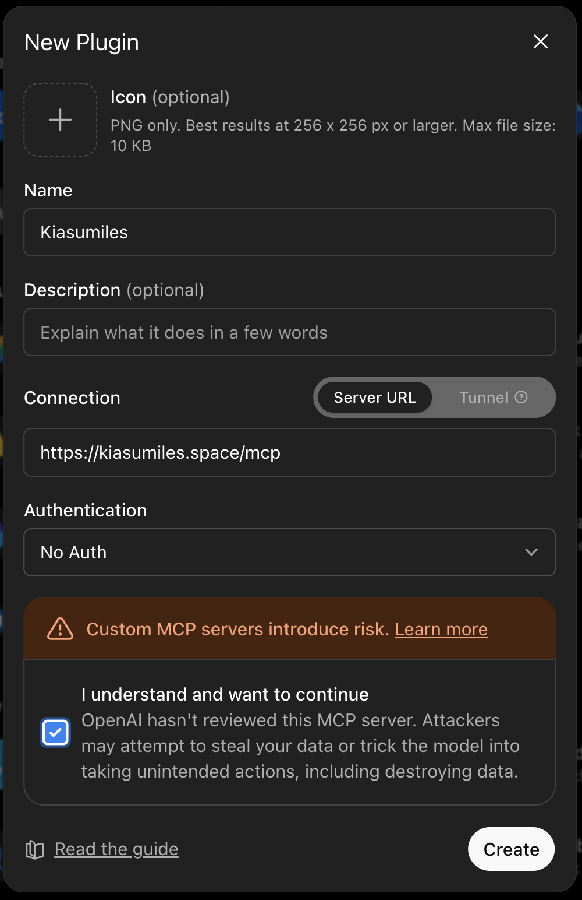

# KiasuMiles

<p align="center">
  <a href="https://kiasumiles.space">
    
  </a>
</p>

<p align="center">
  <a href="https://kiasumiles.space"><strong>Visit kiasumiles.space</strong></a>
</p>

> “Which card do I use again?”

KiasuMiles helps an AI agent choose the best Singapore miles card from the cards you already hold. It compares your confirmed cards against centrally maintained card rules and merchant-category data, then explains the best card, payment method, conditions, cap and fallback.

KiasuMiles is a hosted **MCP** service. MCP is the connection that lets a compatible agent use KiasuMiles as a tool. It is not a standalone chatbot or web app.

The hosted service does not store your card stack. It never needs your card number, expiry date, CVV, banking login, one-time password or payment credentials.

## Start here

KiasuMiles ONLY works with AI assistants that can use external tools. Choose the setup for your assistant below.

After the one-time connection, send this message:

```text
Use KiasuMiles. First verify the connection by calling kiasumiles_data_version. Ask which cards I carry only if you don’t already know; show supported cards if I need help choosing. Then ask where I’m paying and how, and recommend my best confirmed card with its earn rate, bonus conditions and fallback. If KiasuMiles tools aren’t available, stop and tell me.
```

This prompt verifies and uses an existing connection. It cannot give an ordinary chatbot capabilities that the app does not provide.

## Where it works

Status as of 9 September 2026:

| Agent | Current route | Plug-and-play status |
|---|---|---|
| Claude chat, Cowork, desktop and mobile | Account-level custom connector | Available after one-time setup; the directory submission is still under review |
| Codex desktop and CLI | Custom remote MCP server | Available now |
| OpenClaw, Hermes, Zo and similar agents | Agent-managed remote MCP connection | Paste the prompt above when the agent is allowed to update its MCP configuration |
| ChatGPT Work on web and mobile | Private custom connector created on ChatGPT web | Tested on a Pro account; public directory approval is not required for this route |

KiasuMiles is not a normal chatbot. It is an MCP tool, so the assistant must support external tools and have KiasuMiles connected before the usage prompt can work.

## One-time connection options

### Agent-managed setup

For an agent that can update its own MCP configuration, such as OpenClaw, Hermes or Zo, paste this into its chat:

```text
Use KiasuMiles. If its tools are already available, reuse them. Otherwise, connect to https://kiasumiles.space/mcp if you can manage remote MCP connections. Ask before changing settings or installing anything. If you cannot, say that this agent needs a one-time MCP connection and stop. Do not claim KiasuMiles is connected until you can list its tools and call kiasumiles_data_version successfully. Then ask which banks I use, show their supported cards, and let me confirm mine. Finally, ask for a Singapore merchant and payment method and recommend the best confirmed card with its conditions and fallback.
```

### Codex desktop or CLI

In Codex desktop, add a Streamable HTTP MCP server named `KiasuMiles` with:

```text
https://kiasumiles.space/mcp
```

For Codex CLI:

```bash
codex mcp add kiasumiles --url https://kiasumiles.space/mcp
codex mcp list
```

### Claude

In the Claude app, open **Settings → Customise → Connectors → Add custom connector**, name it `KiasuMiles`, and enter:

```text
https://kiasumiles.space/mcp
```

Start a new Claude chat, enable KiasuMiles from the **+** menu, then send the Start here prompt. Anthropic documents account-level remote connectors across Claude, Cowork, desktop and mobile. Workspace policies may require an administrator to approve the connector. See [Claude's remote MCP connector guide](https://support.claude.com/en/articles/11175166-get-started-with-custom-connectors-using-remote-mcp).

### ChatGPT Work

Set up once on ChatGPT web, then use KiasuMiles in Work on web or mobile. This route passed native MCP tests on a ChatGPT Pro account. Availability may vary by account and plan; ordinary ChatGPT Chat was not verified by these tests.

1. On ChatGPT web, open **Settings → Plugins → Developer mode** and enable it.
2. Open **Plugins** from the sidebar. Click the **+ beside the search bar** to open **New Plugin**.
3. Enter **KiasuMiles** as the name. Choose **Server URL**, enter `https://kiasumiles.space/mcp`, and set Authentication to **No Auth**. Leave the optional fields blank.
4. Read the warning, tick **I understand and want to continue**, then select **Create → Connect**.
5. Start a **Work** conversation on web or mobile and send the Start here prompt. Approve **Connect** again if prompted, then ask it to continue.



The public directory submission is separately awaiting review. This private setup does not make KiasuMiles publicly listed. We have not verified that the ChatGPT connection carries over to Codex; use the separate Codex instructions above.

## First use

After KiasuMiles is connected:

1. Tell the agent which cards you carry. If you need help, name your banks and choose from their supported cards.
2. Provide a merchant and how you are paying. Include the amount if you want a miles estimate.
3. KiasuMiles compares only the cards supplied for that lookup and returns the recommendation, conditions and fallback.

Reuse your card selection within the conversation. Whether it carries into another conversation depends on your assistant, not KiasuMiles.

Try:

```text
What card should I use at NTUC FairPrice with Apple Pay?
```

Other useful questions:

```text
I’m paying for Grab in the app. Which card should I use?
```

```text
Compare how I should pay at Uniqlo using the cards I carry.
```

```text
Does my card stack have any weak categories?
```

## Your card stack and privacy

The hosted MCP server has no wallet-save or wallet-read tools. For each recommendation, the agent supplies the selected card names or identifiers in that request. KiasuMiles returns the result without retaining them as a wallet.

Whether the selection survives a new conversation depends on the agent you use. KiasuMiles cannot promise persistence on another product’s behalf.

Only provide card names. Never provide:

- Card numbers
- Expiry dates or CVVs
- Banking usernames or passwords
- One-time passwords
- Transaction or account credentials

## Troubleshooting

### The agent says it cannot connect

The app does not have permission or capability to add a remote MCP connection. Use its documented plugin or connector setup. Do not ask it to imitate KiasuMiles using general card knowledge.

### The agent says KiasuMiles is connected but cannot call its tools

The connection is not verified. Reload the agent using its documented method, then require it to list the KiasuMiles tools and call `kiasumiles_data_version`.

### Claude says `kiasumiles_data_version` does not exist

Claude has loaded an older local KiasuMiles server instead of the hosted connector. Disable the old local server, start a new Claude chat, enable the remote KiasuMiles connector, and retry. The current hosted connector exposes seven tools, including `kiasumiles_data_version`; do not let Claude replace that check with a different tool.

### My card stack disappeared

The agent did not retain it. Confirm the cards again and ask the agent whether its own storage persists across conversations. The hosted KiasuMiles service is not a wallet store.

### The recommendation is broad or uncertain

Include the exact merchant, outlet when relevant, payment method and transaction amount. Merchant classifications and bank terms can change, so review the returned conditions and fallback before a large or unusual purchase.

### The service returns HTTP 429

The hosted MCP endpoint defaults to 30 requests per 60 seconds per IP address for each running service instance. Wait and retry.

## Supported cards and data

Ask the connected agent:

```text
Show me all cards currently supported by KiasuMiles.
```

The production service reports its data version, record counts and active backend at:

```text
https://kiasumiles.space/health
```

Confidence and last-verified fields are useful signals, not guarantees that every merchant classification or bank rule is current. Recommendations are informational; check the bank’s current terms when the stakes are high.

For supported Amaze pairings, include both Amaze and the paired card in the confirmed stack.

## Hosted MCP reference

KiasuMiles exposes seven read-only MCP tools:

| Tool | Purpose |
|---|---|
| `kiasumiles_list_cards` | Lists supported cards, optionally filtered by bank |
| `kiasumiles_lookup` | Ranks supplied cards for a merchant and payment method |
| `kiasumiles_compare_payment_methods` | Compares supported payment methods in one request |
| `kiasumiles_changes_since` | Summarises source-neutral data changes since a date |
| `kiasumiles_recommend_stack` | Reviews category coverage among supplied cards |
| `kiasumiles_data_version` | Returns the data version, record counts and backend |
| `kiasumiles_agent_guide` | Returns conversation and display guidance |

Hosted lookups are stateless. The caller supplies the selected cards for each lookup, and the server does not retain them as a wallet.

### Test the MCP connection

```bash
curl -i -X POST https://kiasumiles.space/mcp \
  -H 'Content-Type: application/json' \
  -H 'Accept: application/json, text/event-stream' \
  -d '{"jsonrpc":"2.0","id":1,"method":"initialize","params":{"protocolVersion":"2025-06-18","capabilities":{},"clientInfo":{"name":"curl-smoke","version":"1.0"}}}'
```

## For maintainers

Production loads card rules and merchant mappings from Supabase. The repository includes a smaller bundled dataset for development and tests. Lookup and ranking remain deterministic and do not perform live web searches.

Environment variables:

- `KIASUMILES_SUPABASE_URL`
- `KIASUMILES_SUPABASE_SERVICE_ROLE_KEY`
- `KIASUMILES_SUPABASE_CARDS_TABLE` — optional; defaults to `card_rules`
- `KIASUMILES_SUPABASE_MERCHANTS_TABLE` — optional; defaults to `merchant_mcc`
- `KIASUMILES_DATA_BACKEND` — optional; `auto` or `supabase`
- `KIASUMILES_RATE_LIMIT_REQUESTS` — optional; defaults to `30`; `0` disables the MCP rate limit
- `KIASUMILES_RATE_LIMIT_WINDOW_SECONDS` — optional; defaults to `60`

The schema is at [supabase/schema.sql](supabase/schema.sql). Both `/health` and `kiasumiles_data_version` report the selected backend.

### Supabase keep-awake

The `Supabase keep-awake` GitHub Actions workflow performs one direct, read-only `card_rules` query at 08:17, 16:17 and 00:17 Singapore time each day. It never inserts, updates or deletes data.

Store `KIASUMILES_SUPABASE_URL` and `KIASUMILES_SUPABASE_SERVICE_ROLE_KEY` only as encrypted GitHub Actions secrets. Never place either value in source code, logs or a pull request.

## Feedback

If a recommendation appears wrong or a merchant is missing, message [@kiasumilesbot](https://t.me/kiasumilesbot) on Telegram with the merchant, outlet and payment method. Leave out card numbers and personal payment details.

## About

KiasuMiles is built by [Hosan](https://theaiburrow.xyz), founder of [The AI Burrow](https://theaiburrow.xyz), Singapore’s applied AI collective for teams and builders who want to move past the hype and actually deploy.

- [theaiburrow.xyz](https://theaiburrow.xyz)
- Telegram: [t.me/theaiburrow](https://t.me/theaiburrow)
- Email: [hello@theaiburrow.xyz](mailto:hello@theaiburrow.xyz)

MIT License
